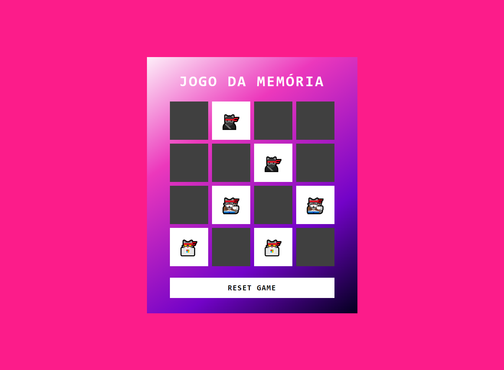

<h1 align="center">JOGO DA MEMÓRIA</h1>

  

## 🚀 Tecnologias

Esse projeto foi desenvolvido com as seguintes tecnologias:

- HTML e CSS
- JavaScript 
- Git e Github

## 💻 Projeto
Criado um projeto web baseado no conhecio jogo da memória, utilizando emojis de gatinhos para deixar o projeto mais divertido e exercitar meu JavaScipt.

## :memo: Licença